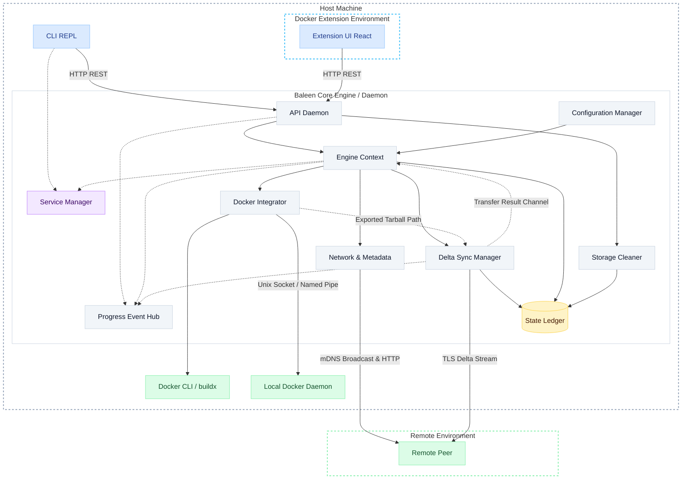

# Baleen Engine 🐳

Baleen Engine is a lightweight, local-first, peer-to-peer Docker image sharing tool designed for small teams and developers sharing a local network (like an office or a hackathon). 

Built as an educational project to explore Go's concurrency model and the Docker Engine SDK, Baleen allows you to share Docker images directly between machines without needing to push to a cloud registry. It is not intended to replace enterprise local registries, but rather to provide a fast, P2P alternative for simple image synchronization among a few peers.

<p align="center">
  
</p>

## 🚀 Key Features

*   **Peer-to-Peer Transfers:** Direct, high-speed TCP socket transfers over persistent TLS — no internet connection or cloud registry required.
*   **Autonomous Discovery:** Built-in `zeroconf` seamlessly discovers other Baleen nodes on your local network automatically.
*   **Delta Transfer Engine:** Smart layer pruning and stitching. Only the layers that the peer is missing are transferred — saving time and bandwidth.
*   **Transfer Controls:** Pause, resume, and cancel any active transfer in real time from the UI.
*   **Approval Workflow:** Incoming transfers require explicit approval before loading into Docker — or enable auto-approve if you trust your network.
*   **Bandwidth Limiting:** Set maximum transfer speeds to avoid saturating your network.
*   **Smart Architecture Detection:** Automatically handles multi-architecture image resolution across different platforms via `docker buildx`.
*   **Ledger & History:** Full synchronization history powered by `bbolt` — track every image that's been shared.
*   **Dual-Mode Interface:** Use the fully integrated Docker Desktop Extension UI, or the interactive CLI via `docker baleen`.
*   **Cross-Platform Support:** Works on macOS, Linux, and Windows.

## 📦 Installation

Baleen Engine is distributed as a Docker Desktop Extension. Ensure you have Docker Desktop installed, then run the following command to install the extension:

```bash
docker extension install yehankanishka/baleen-engine:latest
```

> **Note:** If you receive an error, go to Docker Desktop **Settings > Extensions** and ensure that the **"Allow only extensions distributed through the Docker Marketplace"** option is **unchecked**.

Once installed, Baleen will be available in the Extensions sidebar of your Docker Desktop application.

## ⚙️ Architecture Overview

The Baleen "engine" serves as the core logic for this distributed distribution system. It leverages Go's concurrency model for maximum throughput during image extraction and export. 



## 🧩 Core Components

The codebase is organized into modular packages located in the `internal/` directory, orchestrating the different responsibilities of the engine:

*   **`api`**: Hosts the local HTTP daemon, serving REST endpoints for state polling. It serves as the primary interface for both the CLI and the Docker Desktop Extension UI.
*   **`cli`**: Provides the interactive Read-Eval-Print Loop (REPL) command-line interface, giving users terminal-based control over transfers and peer management.
*   **`config`**: Manages user configuration, global application state, and configuration paths (`~/.baleen`).
*   **`docker`**: Wraps the Docker Engine SDK. Handles the extraction, manipulation, and loading of container images directly via the local Docker daemon socket.
*   **`ledger`**: Manages the local `bbolt` key-value store. It is responsible for tracking sync history, layer chunk hashes, and caching state.
*   **`network`**: Handles autonomous peer discovery on the local network using `zeroconf` (mDNS/DNS-SD) and manages the TLS certificate generation and handshake.
*   **`service`**: Controls the lifecycle of the background daemon, tracking its state (PID, dynamic API token, active port) and ensuring single-instance execution.
*   **`transfer`**: The core delta-sync engine. It manages the chunking, layer pruning, and secure transmission of image layers between peers over TLS.

## 🛠️ Tech Stack

| Category | Technology / Library | Purpose |
| :--- | :--- | :--- |
| **Backend Core** | Go | Core engine language for the daemon and CLI |
| **Container Integration** | Docker Engine SDK | Docker API integration (export, buildx, load) |
| **Storage / Ledger** | `bbolt` | Key-value store for synchronization history and caching |
| **Network Discovery** | `zeroconf` | mDNS/DNS-SD for autonomous peer discovery on LAN |
| **Interactive CLI** | `readline` | Interactive command-line loop and prompts |
| **Frontend Stack** | React (18+), Vite, Tailwind CSS, Lucide React, TypeScript | Framework, build tool, styling, icons, and static typing for the UI |
| **Docker Ext API** | Docker Extension API Client | Integration with Docker Desktop frontend |

## 🔒 Security & Trust Model

Baleen Engine is designed for local-first peer-to-peer sharing. 
- **Encryption:** All P2P transfers are encrypted over TLS. We explicitly enforce **TLS 1.3 with mandatory ECDHE** (Elliptic Curve Diffie-Hellman Ephemeral) key exchange to guarantee Forward Secrecy. Each daemon session generates a fresh, ephemeral **ECDSA P-256** self-signed certificate in memory. Data integrity and certificate fingerprints are verified using SHA-256.
- **Dynamic LAN Trust:** Because there is no central certificate authority, Baleen dynamically relies on certificate fingerprints broadcasted by peers over the unauthenticated mDNS protocol.
- **Approval Workflow:** By default, to prevent unauthorized images from being pushed to your machine, **incoming transfers require explicit user approval** via the CLI or UI before any data is loaded into Docker. This can be configured to auto-approve via your transfer settings if you fully trust your local network. *(Note: Baleen treats the local network similarly to an open SMB share).*
- **API Security:** The local management API binds exclusively to `127.0.0.1` and enforces strict CORS policies (`localhost`, `127.0.0.1`, `docker-desktop://`). Furthermore, all API requests require a dynamically generated Bearer token (stored in `~/.baleen/service.json`) to prevent CSRF and unauthorized local access.

## 💻 CLI Usage

Baleen also ships as a Docker CLI plugin. After installing the extension, use it from the terminal:

```bash
docker baleen
```

This opens an interactive REPL where you can manage everything from the command line:

```
Commands:
  push <NODE_NAME_OR_IP:PORT> <IMAGE>  - Send a Docker image to target
  peers                                - Show active nodes on network
  history                              - View the transfer ledger
  gc <all|old|hash> [-rm]              - Run garbage collection
  prune                                - Clean up old docker images
  logs                                 - View recent daemon logs
  clean logs [-rm]                     - Truncate daemon log (use -rm to delete)
  stop                                 - Stop the engine and exit
  exit                                 - Disconnect CLI (engine keeps running)
```

## 📁 Local Data (`~/.baleen`)

Baleen Engine stores its state, caches, and configuration entirely on local disk within the `~/.baleen` directory. No data is sent to the cloud.

*   **`baleen.db`**: A lightweight `bbolt` key-value store holding your synchronization ledger, peer history, and layer chunk hashes.
*   **`service.json`**: Contains the state of the active background daemon (e.g., port, PID, dynamically generated API token, node name).
*   **`transfer_settings.json`**: User-configurable settings (like `auto_approve` workflows and `max_bandwidth` limits).
*   **`network_settings.json`**: Network feature flags (`mdns_discovery` and `broadcast_presence` toggles).
*   **`incoming/` & `temp/`**: Staging directories used to temporarily store chunks of Docker images during extraction and reception before they are loaded into the Docker daemon.
*   **`layers/`**: Local layer cache — enables delta transfers by storing previously seen layers.

## 📄 License

This project is licensed under the [MIT License](LICENSE).
