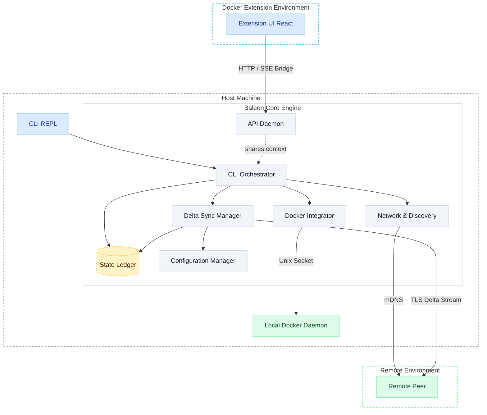

# Baleen Engine 🐳

Baleen Engine is a high-speed, local-first, peer-to-peer Docker image sharing engine. It completely bypasses cloud registries and internet bottlenecks, allowing you to synchronize Docker images directly between machines on your local network.

> **🚧 Project Status:** This project is currently in **active development (ongoing)**. The core engine is functional, but features, architecture, and APIs are subject to change as development continues. 

## 🚀 Key Features

*   **Peer-to-Peer Transfers:** Direct, high-speed TCP socket transfers over ephemeral TLS — no internet connection or cloud registry required.
*   **Autonomous Discovery:** Built-in `zeroconf` seamlessly handles machine discovery on your local network.
*   **Immutable Ledger:** Uses a Git-like historical ledger powered by `bbolt` to track image synchronization history and cache layers.
*   **Delta Transfer Engine:** Smart layer pruning and stitching. Only the layers that the peer is missing are transferred.
*   **Smart Architecture Detection:** Automatically handles multi-architecture image resolution across different platforms via `docker buildx`.
*   **Dual-Mode Interface:** Run as a lightweight background daemon with an interactive hybrid CLI, or use the fully integrated Docker Desktop Extension with a visual React-based UI.
*   **Cross-Platform Support:** Written in Go with native Docker SDK integration, supporting deployment on Windows, macOS, and Linux.

## 🛠️ Tech Stack

*   **Core Engine:** Go 1.22+
*   **Container Integration:** Docker Engine SDK
*   **Storage / Ledger:** `bbolt`
*   **Network Discovery:** `zeroconf` (mDNS/DNS-SD)
*   **UI / Extension:** React, TypeScript, Vite, Tailwind CSS

## ⚙️ Architecture Overview

The Baleen "engine" serves as the core logic for this distributed distribution system. It leverages Go's concurrency model for maximum throughput during image extraction and export. 

### Core Components (`internal/`)

- **`cli`**: Interactive REPL loop for pushing images, viewing peers, checking history, and pruning.
- **`api`**: HTTP daemon server providing endpoints for the UI to monitor transfers, peers, images, and live logs (SSE).
- **`config`**: Core node setup, application paths, and generated node names.
- **`network`**: Peer discovery via `zeroconf` mDNS and secure connections via ephemeral RSA-2048 self-signed TLS certificates.
- **`transfer`**: Delta stream engine that negotiates layer diffs, sending only missing layers and verifying integrity via SHA-256.
- **`ledger`**: `bbolt` powered key-value store for commit history and local layer caching.
- **`docker`**: Integration with Docker SDK to inspect, export, buildx (cross-compile), and load images.

### Docker Desktop Extension (`ui/`)

A React-based UI that runs inside Docker Desktop, communicating with the Baleen background daemon. It visualizes local peers, tracks real-time transfers, and displays the immutable ledger of sharing history.

